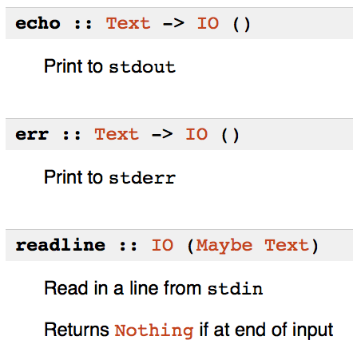

% Haskell for Shell Scripting
% Gabriel Gonzalez
% April 8, 2015

# Before class

If you haven't installed `ghc`, yet:

```bash
$ echo "/home/ggonzalez/tools/ghc-7.8.3-Darwin.x86_64" >> ~/.tools
$ sync-dottools.sh
```

... then open a new terminal window.

To test your Haskell installation, run these commands:

```bash
$ echo 'main = putStrLn "Hello, world!"' > hello.hs
$ runhaskell hello.hs
Hello, world!
```

Install the shell scripting library using these commands:

```bash
$ cabal update
$ cabal install turtle-1.1.0
```

# Outline

* **Haskell overview**
* Subroutines
* Types
* Use `ghci` as a shell
* Type signatures
* String formatting
* Streams
* Pipes
* Folds
* Patterns

I've hosted slides on go/learn so that people can follow along locally

# Overview of Haskell

Haskell is a purely functional language with strong and static types

* **Purely functional** means side effect order is not tied to evaluation order

* **Strong** types are fine-grained (i.e. `FilePath`/`Time`/`Name` vs `String`)

* **Static** types catch errors at compile time

Haskell can be both **interpreted** or **compiled** to a native binary

Haskell is a managed language, providing garbage collection, concurrency, and
transactional shared memory:

* **Garbage collection** is generational and efficient (measured in GB / s)
* **Concurrency** uses green-threads and is efficient (world record for SDN)
* **Transactional memory** simplifies race-free concurrent code without polling

# Biggest disadvantages of Haskell

* Not a JVM language
* Beginners can't easily reason about performance
* Built-in record syntax is clumsy
* Most language features are libraries, which hampers discoverability
* Culture of abstraction astronauts (myself included)

# Comparing Haskell to Scala

Similarities:

* Static types
* Strong types
* Functional
* Automatic memory management

Differences:

* Haskell is not object-oriented
* Haskell is not a JVM language
* Haskell has a faster startup time (10 ms compiled, < 1 second interpreted)
* Haskell compiles to native code

# Comparing Haskell to Python

Similarities

* Lightweight syntax
* Significant whitespace (with optional curly braces)
* Procedural
* Automatic memory management

Differences:

* Haskell is statically typed (unless you enable `-fdefer-type-errors`)
* Haskell is strongly typed
* Haskell compiler/interpreter not pre-installed on most Unix-like systems
* Haskell compiles to native code

# Why use Haskell for shell scripting?

Haskell has light-weight syntax and fast start-up times

Haskell code is easy to refactor and maintain

# Hello, world!

Save this to: `example.hs`:

```haskell
#!/usr/bin/env runhaskell
                                    -- #!/bin/bash
{-# LANGUAGE OverloadedStrings #-}  --
                                    --
import Turtle                       --
                                    --
main = echo "Hello, world!"         -- echo Hello, world!
```

... then run the example:

```bash
$ chmod u+x example.hs
$ ./example.hs
Hello, world!
```

# Create a native binary

```bash
$ ghc -O2 -threaded example.hs
$ ./example
Hello, world!
```

# Use Haskell interactively

```haskell
$ ghci -v0
Prelude> :set -XOverloadedStrings
Prelude> import Turtle
Prelude Turtle> echo "Hello, world!"
Hello, world!
Prelude Turtle> 2 + 2
4
Prelude Turtle> let f x = x + x
Prelude Turtle> f 2
4
Prelude Turtle> :quit
```

# Load code into the REPL

```haskell
$ ghci -v0 example.hs
*Main> main
Hello, world!
*Main> :quit
```

# Exercise

What do you think this code does?

```haskell
#!/usr/bin/env runhaskell

{-# LANGUAGE OverloadedStrings #-}

import Turtle

say = echo

main = say "Hello, world!"
```

# Questions?

* Haskell overview
* **Subroutines**
* Types
* Use `ghci` as a shell
* Type signatures
* String formatting
* Streams
* Pipes
* Folds
* Patterns

# Values

```haskell
#!/usr/bin/env runhaskell
                                    -- #!/bin/bash
{-# LANGUAGE OverloadedStrings #-}  --
                                    --
import Turtle                       --
                                    --
str = "Hello, world!"               -- STR='Hello, world!'
                                    --
main = echo str                     -- echo $STR
```

```bash
$ ./example.hs
Hello, world!
```

`str` is immutable (analogous to Scala's `val`)

Why do you think Haskell defaults to immutability?

# Order of definitions does not matter

```haskell
#!/usr/bin/env runhaskell

{-# LANGUAGE OverloadedStrings #-}

import Turtle

main = echo str

str = "Hello, world!"
```

# You need `main`

Modify your program to to eliminate `main`:

```haskell
#!/usr/bin/env runhaskell

{-# LANGUAGE OverloadedStrings #-}

import Turtle

echo "Hello, world!"
```

You will get this error message if you run the program:

```bash
example.hs:7:1: Parse error: naked expression at top level
```

The top level of a Haskell program is declarative and only allows definitions

You cannot execute code at the top level

# Subroutines

Use `do` to create a subroutine that runs more than one command:

Using significant whitespace:

```haskell
#!/usr/bin/env runhaskell
                                    -- #!/bin/bash
{-# LANGUAGE OverloadedStrings #-}  --
                                    --
import Turtle                       --
                                    --
main = do                           --
    echo "Line 1"                   -- echo Line 1
    echo "Line 2"                   -- echo Line 2
```

```bash
$ ./example.hs
Line 1
Line 2
```

# You can opt out of significant whitespace

```haskell
main = do
    { echo "Line 1"
    ; echo "Line 2"
    }
```

```haskell
main = do {
    echo "Line 1";
    echo "Line 2";
    }
```

```haskell
main = do { echo "Line1"; echo "Line2" }
```

# Storing results

```haskell
#!/usr/bin/env runhaskell
                           -- #!/bin/bash
import Turtle              --
                           --
main = do                  --
    dir  <- pwd            -- DIR=$(pwd)
    time <- datefile dir   -- TIME=$(date -r $DIR)
    print time             -- echo $TIME
```

```haskell
$ ./example.hs
2015-01-24 03:40:31 UTC
```

Why not this?

```haskell
main = print(datetime(pwd))
```


# Difference between `(=)` and `(<-)`

* `(<-)` is overloaded; in this context it means "store the subroutine's result"
* `(=)` is not overloaded; equating two things means they are interchangeable

Example of overloading `(<-)`:

```haskell
Prelude> do { x <- [1, 2]; y <- [3, 4]; return (x, y) }
[(1,3),(1,4),(2,3),(2,4)]
```

`do`/`(<-)`/`return` is analogous to `for`/`(<-)`/`yield` in Scala:

```scala
scala> for { x <- Seq(1, 2); y <- Seq(3, 4) } yield (x, y)
res0: Seq[(Int, Int)] = List((1,3), (1,4), (2,3), (2,4))
```

# Nesting subroutines

```haskell
#!/usr/bin/env runhaskell
                            -- #!/bin/bash
import Turtle               --
                            --
datePwd = do                -- datePwd() {
    dir    <- pwd           --     DIR=$(pwd)
    result <- datefile dir  --     RESULT=$(date -r $DIR)
    return result           --     echo $RESULT
                            -- }
main = do                   --
    time <- datePwd         -- TIME=$(datePwd)
    print time              -- echo $TIME
```

Same result:

```haskell
$ ./example.hs
2015-01-24 03:40:31 UTC
```

# Unnecessary `return`

You can simplify this:

```haskell
datePwd = do                -- datePwd() {
    dir    <- pwd           --     DIR=$(pwd)
    result <- datefile dir  --     RESULT=$(date -r $DIR)
    return result           --     echo $RESULT
                            -- }
```

... to this:

```haskell
datePwd = do      -- datePwd() {
    dir <- pwd    --     DIR=$(pwd)
    datefile dir  --     date -r $DIR
                  -- }
```

The return value of a subroutine is the return value of its last command

# `return`

`return` does not break from the surrounding subroutine

`return` is just a command whose return value is its argument

```haskell
do x <- return expr  -- X=EXPR
   command x         -- command $X

-- Same as:
do let x = expr      -- X=EXPR
   command x         -- command $X

-- Same as:
command expr         -- command EXPR
```

`return` is the only case where `(<-)` and `(=)` behave the same way

# Single-command subroutines

```haskell
main = do echo "Hello, world!"

-- Same as:
main =    echo "Hello, world!"
```

`do` is only necessary if you want to chain multiple commands together

# Exercise

What do you think this code does?

```haskell
main = do
    let x = print 1
    print 2
```

# Questions?

* Haskell overview
* Subroutines
* **Types**
* Use `ghci` as a shell
* Type signatures
* String formatting
* Streams
* Pipes
* Folds
* Patterns

# Types

What happens if we use `print` instead of `echo`?

```haskell
#!/usr/bin/env runhaskell

import Turtle

main = do
    dir  <- pwd
    time <- datefile dir
    echo time             -- This used to be: print time
```

```
$ ./example.hs

example.hs:8:10:
    Couldn't match expected type `Text' with actual type `UTCTime'
    In the first argument of `echo', namely `time'
    In a stmt of a 'do' block: echo time
    In the expression:
      do { dir <- pwd;
           time <- datefile dir;
           echo time }
```

# Type-directed development - REPL

```haskell
main = do
    dir  <- pwd
    time <- datefile dir
    echo time             -- This used to be: print time
```

```haskell
$ ghci -v0
Prelude> :set -XOverloadedStrings
Prelude> import Turtle
```

```haskell
Prelude Turtle> :type pwd
pwd :: IO Turtle.FilePath
```

```haskell
Prelude Turtle> :type datefile
datefile :: Turtle.FilePath -> IO UTCTime
```

```haskell
Prelude Turtle> :type echo
echo :: Text -> IO ()
```

```haskell
Prelude Turtle> :type print
print :: Show a => a -> IO ()
```

# Type-directed development - Documentation

Visit:

https://hackage.haskell.org/package/turtle



# `repr`

Use `repr` to render a human-readable representation of a value as `Text`:

```haskell
-- This behaves like Python's `repr` function
repr :: Show a => a -> Text
```

`print` is (conceptually) the same as `echo` + `repr`:

```haskell
print x = echo (repr x)
```

# Basic types

* `Int`
* `Double`
* `Text`
* `(a, b)`
* `[a]`
* `a -> b`
* `IO a`
* `FilePath`
* `ExitCode`
* `UTCTime`

# Exercise

What are the types of `x`, `y`, and `z`? 

(Assume all string literals are `Text` and all numeric literals are `Int`s)

```haskell
x = ("123", 4)

y = [2, 3]

z a = 1 + a
```

# Answers

```haskell
x :: (Text, Int)
x = ("123", 4)

y :: [Int]
y = [2, 3]

z :: Int -> Int
z a = 1 + a
```

# Questions?

* Haskell overview
* Subroutines
* Types
* **Use `ghci` as a shell**
* Type signatures
* String formatting
* Streams
* Pipes
* Folds
* Patterns

# Customize `ghci`

Create a `.ghci` file in your current directory that looks like this:

```
:set -XOverloadedStrings
import Turtle
```

This automatically runs the above two commands every time you run `ghci`

`ghci` searches the current directory and your home directory for a `.ghci` file

# Use `ghci` like a shell

```haskell
$ ghci -v0
Prelude Turtle> view (ls ".")
FilePath "/Users/ggonzalez/.bash_history"
FilePath "/Users/ggonzalez/.bash_profile"
FilePath "/Users/ggonzalez/.bashrc"
...
FilePath "/Users/ggonzalez/workspace"
Prelude Turtle> cd "/tmp"
Prelude Turtle> pwd
FilePath "/private/tmp"
Prelude Turtle> touch "foo.txt"
Prelude Turtle> testfile "foo.txt"
True
Prelude Turtle> rm "foo.txt"
Prelude Turtle> testfile "foo.txt"
False
Prelude Turtle> test<TAB>
testdir   testfile
Prelude Turtle> testdir "/tmp/<TAB>
.vbox-ggonzalez-ipc
KSOutOfProcessFetcher.0.r55jifrBu08ZlGAfPLYXKgYad4c=
launch-0kuyez
...
sync-dottools.stdout.log
```

# `ghci` auto-`print`

`ghci` implicitly `print`s any value that is not a subroutine

```haskell
Prelude Turtle> 2 + 2
4
Prelude Turtle> "123" <> "456"  -- (<>) concatenates strings
"123456"
```

The behavior is the same as if we had explicitly called `print`:

```haskell
Prelude Turtle> print (2 + 2)
4
Prelude Turtle> print ("123" <> "456")
"123456"
```

# Shell commands

```haskell
Prelude Turtle> shell "true" empty
ExitSuccess
Prelude Turtle> shell "false" empty
ExitFailure 1
Prelude Turtle> shell "ls | wc -l" empty
       5
ExitSuccess
```

Use `proc` if you want safer command templating:

```haskell
Prelude Turtle> -- ls /tmp /usr
Prelude Turtle> proc "ls" ["/tmp", "/usr"] empty
/tmp:
KSOutOfProcessFetcher.0.r55jifrBu08ZlGAfPLYXKgYad4c=
...

/usr:
X11        bin        lib        local      share
X11R6      include    libexec    sbin       standalone
ExitSuccess
```

# Exercise

Within `ghci`:

* Create a directory named `dir1`
* Rename `dir1` to `dir2`
* Delete `dir2`

# Answers

```haskell
Prelude Turtle> mkdir "dir1"
Prelude Turtle> mv "dir1" "dir2"
Prelude Turtle> rmdir "dir2"
```

# Questions?

* Haskell overview
* Subroutines
* Types
* Use `ghci` as a shell
* **Type signatures**
* String formatting
* Streams
* Pipes
* Folds
* Patterns

# Type signatures

```haskell
#!/usr/bin/env runhaskell

import Turtle

--         +----- A subroutine ...
--         |
--         |  +-- ... that returns `UTCTime`
--         |  |
--         v  v
datePwd :: IO UTCTime
datePwd = do
    dir <- pwd
    datefile dir

--      +----- A subroutine ...
--      |
--      |  +-- ... that returns an empty value (i.e. `()`)
--      |  |
--      v  v
main :: IO ()
main = do
    time <- datePwd
    print time
```

# Machine-checked documentation

```haskell
str :: Int  -- Oops!
str = "Hello!"

main :: IO ()
main = echo str
```

```bash
$ ./example.hs

example.hs:8:7:
    No instance for (IsString Int)
      arising from the literal `"Hello, world!"'
    Possible fix: add an instance declaration for (IsString Int)
    In the expression: "Hello, world!"
    In an equation for `str': str = "Hello, world!"

example.hs:11:13:
    Couldn't match expected type `Text' with actual type `Int'
    In the first argument of `echo', namely `str'
    In the expression: echo str
    In an equation for `main': main = echo str
```

# `OverloadedStrings`

Anything that implements `IsString` can be represented by a string literal

Examples we've seen so far:

* `FilePath`
* `Text`
* ???

# Reverse the error

```haskell
str :: Text
str = 4

main :: IO ()
main = echo str
```

```bash
$ ./example.hs

example.hs:8:7:
    No instance for (Num Text)
      arising from the literal `4'
    Possible fix: add an instance declaration for (Num Text)
    In the expression: 4
    In an equation for `str': str = 4
```

# `Num`

Anything that implements `Num` can be represented by a numeric literal

Examples we've seen so far:

* `Int`
* `Double`
* ???

# Types clarify documentation

```haskell
shell
    :: Text         -- Command line
    -> Shell Text   -- Standard input (as lines of `Text`)
    -> IO ExitCode  -- Exit code of the shell command
```

```haskell
proc
    :: Text         -- Program
    -> [Text]       -- Arguments
    -> Shell Text   -- Standard input (as lines of `Text`)
    -> IO ExitCode  -- Exit code of the shell command
```

# Type inference

Haskell (almost always) does not require type annotations

Type signatures are for the benefit of the programmer, not the compiler

Example:

```haskell
Prelude Turtle> let addAsText x y = repr (x + y)
Prelude Turtle> :type addAsText
addAsText :: (Show a, Num a) => a -> a -> Text
Prelude Turtle> addAsText 2 3
"5"
```

No need to annotate argument types

No need to specify interfaces

No need to specify generic type parameters

# Exercise

Use the compiler to infer the type of this function:

```haskell
swap (x, y) = (y, x)
```

# Answer

```haskell
Prelude Turtle> :type swap
swap :: (t1, t) -> (t, t1)
```

# Questions?

* Haskell overview
* Subroutines
* Types
* Use `ghci` as a shell
* Type signatures
* **String formatting**
* Streams
* Pipes
* Folds
* Patterns

# Exit codes

```haskell
#!/usr/bin/env runhaskell

{-# LANGUAGE OverloadedStrings #-}

import Turtle

main = do
    let cmd = "false"
    x <- shell cmd empty
    case x of
        ExitSuccess   -> return ()
        ExitFailure n -> die (cmd <> " failed with exit code: " <> repr n)
```

This always prints an error message since `false` always fails:

```
$ ./example.hs
example.hs: user error (false failed with exit code: 1)
```

# String formatting

We can replace this:

```haskell
cmd <> " failed with exit code: " <> repr n
```

... with `printf`-style formatting:

```haskell
format (s%" failed with exit code: "%d) cmd n
```

The compiler infers the number and types of arguments from the format string:

```haskell
Prelude Turtle> :type format (s%" failed with exit code: "%d)
format (s%" failed with exit code: "%d) :: Text -> Int -> Text
```

# Exercise

What do you think these print out?

```haskell
Prelude Turtle> format ("A "%s%" string that takes "%d%" arguments") "format" 2
```

```haskell
Prelude Turtle> format "I take 0 arguments"
```

# The `Format` type

A format string is not `Text`!

```haskell
Prelude Turtle> :type format
format :: Format Text r -> r
```

So what is going on here?

```haskell
Prelude Turtle> format "I take 0 arguments"
```

# `Format` implements `IsString`

```haskell
(%) :: Format b c -> Format a b -> Format a c

"A "                  :: Format a            a
s                     :: Format a (String -> a)
" string that takes " :: Format a            a
d                     :: Format a (Int    -> a)
" arguments"          :: Format a            a

"A "%s%" string that takes "%d%" arguments" :: Format a (Text -> Int -> a)

format "A "%s%" string that takes "%d%" arguments" :: Text -> Int -> Text
```

You can build your own format specifiers!

# `OverloadedStrings`

Examples we've seen so far:

* `FilePath`
* `Text`
* `Format`
* ???

# Questions?

* Haskell overview
* Subroutines
* Types
* Use `ghci` as a shell
* Type signatures
* String formatting
* **Streams**
* Pipes
* Folds
* Patterns

# Streams

You've already encountered at least one stream: the `ls` command

```haskell
Prelude Turtle> :type ls
ls :: Turtle.FilePath -> Shell Turtle.FilePath
```

A "`Shell a`" is a stream of "`a`"s 

Streams are not subroutines, so you can't run them directly within `ghci`:


```haskell
Prelude Turtle> ls "/tmp"

<interactive>:2:1:
    No instance for (Show (Shell Turtle.FilePath))
      arising from a use of `print'
    Possible fix:
      add an instance declaration for (Show (Shell Turtle.FilePath))
    In a stmt of an interactive GHCi command: print it
```

`ghci` tries to `print` the `Shell` stream, but fails because `Shell` does not
implement `Show`

# `view`

The `view` command is the simplest way to display a `Shell` stream:

```haskell
view :: Show a => Shell a -> IO ()
```

`view` prints every element of the stream:

```haskell
Prelude Turtle> view (ls "/tmp")
FilePath "/tmp/.X11-unix"
FilePath "/tmp/.X0-lock"
FilePath "/tmp/pulse-PKdhtXMmr18n"
FilePath "/tmp/pulse-xHYcZ3zmN3Fv"
FilePath "/tmp/tracker-gabriel"
FilePath "/tmp/pulse-PYi1hSlWgNj2"
FilePath "/tmp/orbit-gabriel"
FilePath "/tmp/ssh-vREYGbWGpiCa"
FilePath "/tmp/.ICE-unix
```

# The empty stream

```haskell
empty :: Shell a
```

The empty stream emits nothing:

```haskell
Prelude Turtle> view empty  -- Outputs nothing
Prelude Turtle>
```

In other words:

```haskell
view empty = return ()
```

# The singleton stream

```haskell
return :: a -> Shell a
```

`return` builds a singleton stream that emits exactly one element:

```haskell
       1 ::       Int
return 1 :: Shell Int
```

```haskell
Prelude Turtle> view (return 1)
1
```

In other words:

```haskell
view (return x) = print x
```

# Embedding subroutines

```haskell
liftIO :: IO a -> Shell a
```

`liftIO` transforms a subroutine into a singleton stream:

```haskell
       pwd :: IO    Turtle.FilePath
liftIO pwd :: Shell Turtle.FilePath
```

```haskell
Prelude Turtle> view (liftIO pwd)
FilePath "/tmp"
```

In other words:

```haskell
view (liftIO io) = do x <- io
                      print x
```

# Concatenate streams

```haskell
(<|>) :: Shell a -> Shell a -> Shell a
```

`(<|>)` concatenates two streams together to build a new stream:

```haskell
Prelude Turtle> view (return 1 <|> return 2)
1
2
```

In other words:

```haskell
view (xs <|> ys) = do view xs
                      view ys
```

# A more complex `Shell` stream

```haskell
Prelude Turtle> view (ls "/tmp" <|> liftIO home <|> ls "/usr" <|> return "/lib")
FilePath "/tmp/.X11-unix"
FilePath "/tmp/.X0-lock"
FilePath "/tmp/pulse-PKdhtXMmr18n"
FilePath "/tmp/pulse-xHYcZ3zmN3Fv"
FilePath "/tmp/tracker-gabriel"
FilePath "/tmp/pulse-PYi1hSlWgNj2"
FilePath "/tmp/orbit-gabriel"
FilePath "/tmp/ssh-vREYGbWGpiCa"
FilePath "/tmp/.ICE-unix"
FilePath "/Users/ggonzalez"
FilePath "/usr/lib"
FilePath "/usr/src"
FilePath "/usr/sbin"
FilePath "/usr/include"
FilePath "/usr/share"
FilePath "/usr/games"
FilePath "/usr/local"
FilePath "/usr/bin"
FilePath "/lib"
```

# Reasoning about streams

```haskell
view (ls "/tmp" <|> liftIO home <|> ls "/usr" <|> return "/lib")
```

... is the same as:

```haskell
do view (ls "/tmp")
   dir <- home
   print dir
   view (ls "/usr")
   print "/lib"
```

# `Shell` implements `IsString`

```haskell
Prelude Turtle> view "123"
"123"
Prelude Turtle> view (return "123")  -- Same thing
"123"
Prelude Turtle> view ("123" <|> "456")
"123"
"456"
Prelude Turtle> view (return "123" <|> return "456")  -- Same thing
"123"
"456"
```

# `OverloadedStrings`

Examples seen so far:

* `FilePath`
* `Text`
* `Format`
* `Shell`
* ???

# `select`

You can build a `Shell` stream from a list:

```haskell
select :: [a] -> Shell a
```

Example:

```haskell
Prelude Turtle> view (select [1, 2, 3])
1
2
3
```

# Loops

We can use `select` to loop within a `Shell`:

```haskell
#!/usr/bin/env runhaskell
                                    -- #!/bin/bash
{-# LANGUAGE OverloadedStrings #-}  --
                                    --
import Turtle                       --
                                    --
example :: Shell ()                 --
example = do                        --
    x <- select [1, 2]              -- for x in 1 2; do
    y <- select [3, 4]              --     for y in 3 4; do
    liftIO (print (x, y))           --         echo \(${x},${y}\);
                                    --     done;
main = sh example                   -- done
```

This prints every permutation of `x` and `y`:

```haskell
$ ./example
(1,3)
(1,4)
(2,3)
(2,4)
```

# The `sh` utility

`sh` is like `view`, except that it doesn't print any elements:

```haskell
view :: Show a => Shell a -> IO ()
sh   ::           Shell a -> IO ()
```

# Looping over arbitrary `Shell`s

You can loop over things other than select:

```haskell
Prelude Turtle> -- for file in /tmp/*; do echo $file; done
Prelude Turtle> sh (do file <- ls "/tmp"; liftIO (print file))
FilePath "/tmp/.X11-unix"
FilePath "/tmp/.X0-lock"
FilePath "/tmp/pulse-PKdhtXMmr18n"
FilePath "/tmp/pulse-xHYcZ3zmN3Fv"
FilePath "/tmp/tracker-gabriel"
FilePath "/tmp/pulse-PYi1hSlWgNj2"
FilePath "/tmp/orbit-gabriel"
FilePath "/tmp/ssh-vREYGbWGpiCa"
FilePath "/tmp/.ICE-unix"
```

In fact, that is how `view` is implemented:

```haskell
view :: Show a => Shell a -> IO ()
view s = sh (do { x <- s; liftIO (print x) })
```

# Questions?

* Haskell overview
* Subroutines
* Types
* Use `ghci` as a shell
* Type signatures
* String formatting
* Streams
* **Pipes**
* Folds
* Patterns

# `stdout`

```haskell
stdout :: Shell Text -> IO ()
stdout s = sh (do
    txt <- s
    liftIO (echo txt) )
```

Standard out writes each `Text` element of the stream to a separate line:

```haskell
Prelude Turtle> stdout "Line 1"
Line 1
Prelude Turtle> stdout ("Line 1" <|> "Line 2")
Line 1
Line 2
```

# `stdin`

```haskell
stdin :: Shell Text
```

`stdin` streams lines from standard input:

```haskell
#!/usr/bin/env runhaskell
                                    -- #!/bin/bash
{-# LANGUAGE OverloadedStrings #-}  --
                                    --
import Turtle                       --
                                    --
main = stdout stdin                 -- cat
```

`stdin` keeps producing lines until hitting EOF:

```bash
$ ./example.hs
ABC<Enter>
ABC
Test<Enter>
Test
42<Enter>
42
<Ctrl-D>
```

# `(&)`

If you prefer to read left-to-right, you can use the infix `(&)` operator:

```
(&) :: a -> (a -> b) -> b
x & f = f x
```

```haskell
main = stdin & stdout
```

# `input` and `output`

```haskell
input :: FilePath -> Shell Text

output :: FilePath -> Shell Text -> IO ()
```

Run these examples:

```haskell
Prelude Turtle> output "file.txt" ("Test" <|> "ABC" <|> "42")
Prelude Turtle> stdout (input "file.txt")
Test
ABC
42
```

Or left-to-right:

```haskell
Prelude Turtle> "Test" <|> "ABC" <|> "42" & output "file.txt"
Prelude Turtle> input "file.txt" & stdout
Test
ABC
42
```

# `inshell` 

```haskell
inshell
    :: Text        -- Command line
    -> Shell Text  -- Standard input to feed to program
    -> Shell Text  -- Standard output produced by program
```

```haskell
Prelude Turtle> output "ls.txt" (inshell "ls" empty)
Prelude Turtle> stdout (input "ls.txt")
.X11-unix
.X0-lock
...
.ICE-unix
```

```haskell
Turtle Prelude> output "awk.txt" (inshell "awk '{ print $1 }'" "123 456")
Turtle Prelude> stdout (input "awk.txt")
123
```

# `inshell` (Left-to-right)

```haskell
Turtle Prelude> "123 456" & inshell "awk" '{ print $1 }' & output "awk.txt"
Turtle Prelude> input "awk.txt" & stdout
123
```

# `inproc`

```haskell
inproc
    :: Text        -- Program
    -> [Text]      -- Arguments
    -> Shell Text  -- Standard input to feed to program
    -> Shell Text  -- Standard output produced by program
```

```haskell
Turtle Prelude> stdout (inproc "awk" ["{ print $1 }"] "123 456")
123
```

# Exercise

Build the following pipeline within the REPL:

* Use `input` to read in `example.hs`
* Use `inshell`/`inproc` to number the lines with the Unix `nl` utility
* Use `output` to write the result to `numbered.txt`

The result should be equivalent to this Unix command:

```bash
$ nl < example.hs > numbered.txt
```

# Answer

```haskell
Prelude Turtle> input "example.hs" & inproc "nl" [] & output "numbered.txt"
```

# Questions?

* Haskell overview
* Subroutines
* Types
* Use `ghci` as a shell
* Type signatures
* String formatting
* Streams
* Pipes
* **Folds**
* Patterns

# Folds

Use a `Fold` to reduce the stream to a single value:

```haskell
Prelude Turtle> import qualified Control.Foldl as Fold
Prelude Turtle Fold> fold (ls "/tmp") Fold.length
9
```

```haskell
Prelude Turtle Fold> fold (ls "/tmp") Fold.head
Just (FilePath "/tmp/.X11-unix")
```

You can combine folds:

```haskell
Prelude Turtle Fold> let minMax = (,) <$> Fold.minimum <*> Fold.maximum
Prelude Turtle Fold> fold (select [1..10]) minMax
(Just 1,Just 10)
```

# Exercise

What are the types of:

* `fold`
* `Fold.length`
* `Fold.head`

# Answer

```haskell
fold :: Shell a -> Fold a b -> IO b

Fold.length :: Fold a Int

Fold.head :: Fold a (Maybe a)
```

```haskell
ls :: Shell Turtle.FilePath

fold                         :: Shell a -> Fold a               b -> IO b
fold (ls "/tmp")             ::            Fold Turtle.FilePath b -> IO b
fold (ls "/tmp") Fold.length ::                                      IO Int
```


# `Fold` implements `Num`

```haskell
>>> fold (select [1..10]) Fold.sum
55
>>> fold (select [1..10]) (1 + 2 * Fold.sum)
111
>>> fold (select [1..10]) (Fold.length + Fold.sum)
65
>>> fold (select [1..10]) 5
5
```

Examples so far:

* Int
* Double
* Fold

# Questions?

* Haskell overview
* Subroutines
* Types
* Use `ghci` as a shell
* Type signatures
* String formatting
* Streams
* Pipes
* Folds
* **Patterns**

# Patterns

You can transform streams using Unix-like utilities, like `grep`:

```haskell
Prelude Turtle> stdout (input "file.txt")
Test
ABC
42
Prelude Turtle> stdout (grep "ABC" (input "file.txt"))
ABC
```

However, the first argument of `grep` is not a string!

```haskell
grep :: Pattern a -> Shell Text -> Shell Text
```

`grep` matches against a `Pattern`, which implements `IsString`

# Comparison to regular expressions

Here is how to translate regular expression idioms to patterns:

```haskell
Regex      Pattern
=========  =========
"string"   "string"
.          dot
e1 e2      e1 <> e2
e1 | e2    e1 <|> e2
e*         star e
e+         plus e
e*?        selfless (star e)
e+?        selfless (plus e)
e{n}       count n e
e?         option e
[xyz]      oneOf "xyz"
[^xyz]     noneOf "xyz"
```

# Pattern examples

```haskell
Prelude Turtle> -- grep '^[[:digit:]]\+$' file.txt
Prelude Turtle> stdout (grep (plus digit) (input "file.txt"))
42
Prelude Turtle> -- grep '^[[:digit:]]\+\|Test$' file.txt
Prelude Turtle> stdout (grep (plus digit <|> "Test") (input "file.txt"))
Test
42
```

# Patterns match the entire string by default

To match the interior of the string, use `has`:

```haskell
Prelude Turtle> -- grep B file.txt
Prelude Turtle> stdout (grep (has "B") (input "file.txt"))
ABC
```

`prefix` and `suffix` match the beginning or end of a string, respectively:

```haskell
Prelude Turtle> -- grep '^A' file.txt
Prelude Turtle> stdout (grep (prefix "A") (input "file.txt"))
ABC
Prelude Turtle> -- grep 'C$' file.txt
Prelude Turtle> stdout (grep (suffix "C") (input "file.txt"))
ABC
```

# `match`

```haskell
match :: Pattern a -> Text -> [a] 
```

```haskell
Prelude Turtle> match ("can" <|> "cat") "cat"
["cat"]
Prelude Turtle> match ("can" <|> "cat") "dog"
[]
Prelude Turtle> match (decimal `sepBy` ",") "1,2,3"
[[1,2,3]]
Prelude Turtle> match (prefix (decimal `sepBy` ",")) "1,2,3"
[[1,2,3],[1,2],[1],[]]
```

# Patterns can do more than regular expressions

```haskell
bit :: Pattern Bool
bit = (do { "0"; return False }) <|> (do { "1"; return True })

portableBitMap :: Pattern [[Bool]]
portableBitMap = do
    "P1"
    spaces1
    width  <- decimal
    spaces1
    height <- decimal
    count width (count height (do { spaces1; bit }))
```

```
Prelude Turtle> match (prefix portableBitMap) "P1\n2 2\n0 0\n1 0\n"
[[[False,False],[True,False]]]
```

```
P1
2 2
0 0
1 0
```

# Real parsing example

```haskell
{-# LANGUAGE OverloadedStrings #-}

import Turtle
import Data.Time

entry :: Text
entry = "2015-03-27 10:25:40+0000 [-] 10.45.209.121 ..."

pattern = do
    year   <- decimal
    "-"
    month  <- decimal
    "-"
    day    <- decimal
    " "
    hour   <- decimal
    ":"
    minute <- decimal
    ":"
    second <- decimal
    let d = fromGregorian year month day
    let t = TimeOfDay hour minute second
    return (d, t)
```

# Patterns are typed

```haskell
$ ghci -v0 pattern.hs
*Main Turtle> :type pattern
pattern :: Pattern (Day, TimeOfDay)
*Main Turtle> match (prefix pattern) entry
[(2015-03-27,10:25:40),(2015-03-27,10:25:04)]
```

# Exercise

Create a pattern that parses two integers stored in a string representation of a
tuple:

```haskell
tuple :: Pattern (Int, Int)
tuple = ???
```

Such that you get this result when you use it:

```haskell
>>> match tuple "(3,4)"
[(3,4)]
```

# Answer

```haskell
tuple :: Pattern (Int, Int)
tuple = do
    "("
    x <- decimal
    ","
    y <- decimal
    ")"
    return (x, y)
```

# Questions?

# Conclusions

You can use Haskell as a "better Bash", getting types for free without slow
startup times or heavyweight syntax.

If you want others to run your Haskell scripts, they can use `dottools` to install
`ghc` on their machine.

I also have a relocatable `ghc` uploaded to Packer that you can use to interpret
scripts on Mesos.

We also have an internal Hackage server at Twitter (go/hackage)

Visit https://hackage.haskell.org/package/turtle for more extensive documentation
on the shell scripting library we used today
